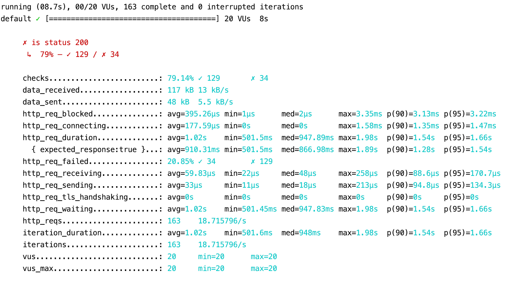

# ДИСКЛЕЙМЕР

- Я приложение написал очень быстро.
- Проверил на утечку памяти, должно быть приемлемо.
- Тестов не делал.
- Проект **специально** написан в одном файлк
- и да, я не знаю go...

Что я обязательно бы добавил
- кобру или аналог чтобы пробрасывать константы (--limit 4)
- нормальный лог
- тесты
- docker
- /health со статистикой
- отрефакторил бы это все

## Запустить

> go run .   

## Дать трафик

> k6 run --vus 10 --duration 5s http_post.js

# TASK
 
HTTP-мультиплексор:
приложение представляет собой http-сервер с одним хендлером
хендлер на вход получает POST-запрос со списком url в json-формате
сервер запрашивает данные по всем этим url и возвращает результат клиенту в json-формате
если в процессе обработки хотя бы одного из url получена ошибка, обработка всего списка прекращается и клиенту возвращается текстовая ошибка Ограничения:
для реализации задачи следует использовать Go 1.13 или выше
использовать можно только компоненты стандартной библиотеки Go
сервер не принимает запрос если количество url в в нем больше 20
сервер не обслуживает больше чем 100 одновременных входящих http-запросов
для каждого входящего запроса должно быть не больше 4 одновременных исходящих
таймаут на запрос одного url - секунда
обработка запроса может быть отменена клиентом в любой момент, это должно повлечь за собой остановку всех операций связанных с этим запросом
сервис должен поддерживать 'graceful shutdown'
результат должен быть выложен на github